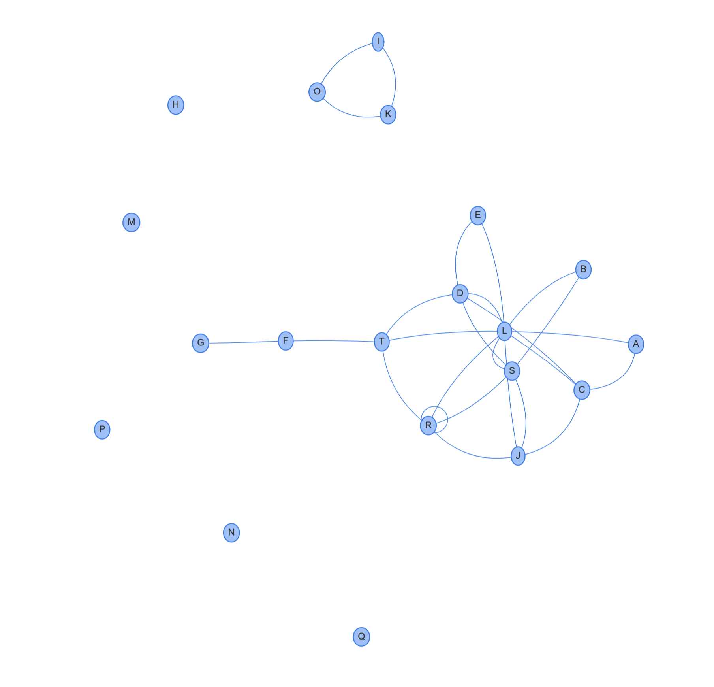

# NotionKnowledgeGraph
This is a project that covers creates a Knowledge Graph representation of [Notion](https://notion.so/) pages, specifically the pages within one or more databases. Each edge is formed when there is a mention of one page to another.



## How it works
This program works by taking in a few database id's, and going over all the pages in those databases.

It then examines each page and looks for any mentions of other pages and builds a graph data structure from this information.

The graph is then saved locally, and the client site can easily get the data, and display it in a nice visual format.
## Installing
To install the dependencies, simply type `npm install` in the cloned directory.

## Getting Started
To work with this project, you will need to do the following:
1. Set up the Notion API by going to the [My Integrations](https://www.notion.so/my-integrations) page.
2. Add a new integration, and you can call it whatever you like. Make sure to set the workspace to the one you want to use for this.
3. Copy the secret key, and create a new file called `.env` in the main directory with the following contents
```
NOTION_KEY=<SECRET>
```

e.g.

```
NOTION_KEY=secret_abcdefghijk
```
4. Go to your Notion Database(s) and select Share, search for your integration name and select it.
5. For each database you want to use, select Share again, and click `Copy Link`. Paste this link somewhere and take note of the Database ID, which will be after the last `/` and before the `?`

All the above steps are also detailed in the Notion API [getting started](https://developers.notion.com/docs) section.


Now, having done all of that, navigate to the main directory, and (assuming you've already run `npm install`) run `npm start`, which should start the server. Then navigate to [`http://localhost:3000`](http://localhost:3000) in your browser and you should see the web page.

In the text input element, enter the database ids from step `5` in a space separated list, e.g. `<id1> <id2> <id3>`.

Then press the `Rebuild Cache` button, and wait for the loading to finish. Then you should see the graph view, and you can begin exploring.

## Customisation
The graph itself is made with [Vis-Network](https://github.com/visjs/vis-network), and there are quite extensive customisation options available.

Some options:
- You can press the `empty` button to remove the labels from your nodes for a tidier view.
- You can press the `config` button to view a configuration menu where you can adjust many of the parameters of the graph itself. More details can be found in their [docs](https://visjs.github.io/vis-network/docs/network/).

## Problems

If you run into any problems, make sure you have shared the correct databases with your integration, and the `.env` file is correctly set up. If any pages mention pages outside the current database, you might also have some problems.

## Notes
Whenever you make changes to your notion workspace, or add pages or mentions, you will need to rebuild the cache first, because the system is not live.